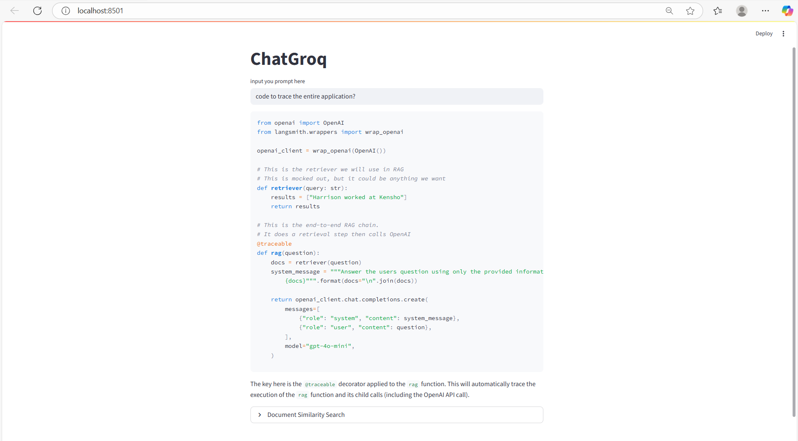

# ChatGroq: A Streamlit-Powered RAG Application

  
*Empowering intelligent conversations with LangChain and Groq*

## 🌟 Project Overview

**ChatGroq** is an interactive web application built using **Streamlit** that leverages **Retrieval-Augmented Generation (RAG)** to provide accurate and context-aware responses to user queries. The application integrates the **LangChain** framework with the **Grok API** (powered by xAI) to retrieve relevant information from a web-based knowledge source and generate precise answers. The project demonstrates a robust implementation of modern NLP techniques, efficient state management, and a user-friendly interface, making it a compelling showcase for recruiters looking for proficiency in AI-driven web applications.

The application fetches data from the LangChain documentation, processes it into manageable chunks, stores it in a **FAISS** vector store for fast retrieval, and uses the **Gemma2-9b-it** model from Groq to generate responses. The use of **session_state** in Streamlit ensures efficient resource management, enhancing performance and user experience.

---

## 🎯 Why This Project Matters

This project highlights a practical application of **RAG**, a cutting-edge approach in natural language processing that combines information retrieval with generative AI. By integrating web scraping, document processing, vector embeddings, and a conversational AI model, ChatGroq showcases:

- **Real-World Relevance**: Demonstrates the ability to build scalable, AI-driven applications for knowledge retrieval and question answering.
- **Technical Proficiency**: Combines multiple modern tools and frameworks (Streamlit, LangChain, FAISS, Groq) to create a cohesive and efficient system.
- **User-Centric Design**: Provides a clean, intuitive interface for users to interact with the AI, with expandable sections for transparency into the retrieval process.

This project is a testament to the developer's ability to architect, implement, and optimize AI-powered solutions, making it an attractive portfolio piece for roles in AI, machine learning, and web development.

---

## 🛠️ What Was Built

### Core Components
1. **Streamlit Frontend**:
   - A clean and responsive user interface built with Streamlit.
   - Features a text input for user queries and an expandable section to display document similarity search results.
   - Displays response generation time for performance transparency.

2. **Data Ingestion and Processing**:
   - Uses `WebBaseLoader` from LangChain to scrape content from the LangChain documentation (`https://docs.langchain.com/langsmith/observability-quickstart`).
   - Splits documents into chunks (1000 characters with 200-character overlap) using `RecursiveCharacterTextSplitter` for efficient processing.

3. **Vector Store and Embeddings**:
   - Employs `OllamaEmbeddings` to create vector representations of document chunks.
   - Stores embeddings in a **FAISS** vector store for fast similarity-based retrieval.

4. **RAG Pipeline**:
   - Integrates the **Grok API** with the `gemma2-9b-it` model for generating contextually accurate responses.
   - Uses a `ChatPromptTemplate` to ensure answers are based solely on the provided context.
   - Combines retrieval (`FAISS.as_retriever`) and generation (`create_stuff_documents_chain`) into a seamless `retrieval_chain`.

5. **Performance Optimization**:
   - Implements `st.session_state` to cache computationally expensive objects (e.g., embeddings, vector store) and avoid redundant processing.
   - Tracks response time using `time.process_time()` to monitor performance.

### Workflow
1. The application loads and processes web content during initialization, storing it in `st.session_state` for persistence.
2. Users input a query via the Streamlit interface.
3. The query is passed to the `retrieval_chain`, which retrieves relevant document chunks and generates a response using the Groq model.
4. The response is displayed, along with the time taken and an expandable section showing the retrieved document chunks for transparency.

---

## 🔑 Importance of `session_state`

The use of **Streamlit's `session_state`** is critical to the project's efficiency and scalability. Here's why:

- **Performance Optimization**: Initializing objects like embeddings, document loaders, and vector stores is computationally expensive. By storing these in `session_state`, the application avoids redundant computations across user interactions, significantly reducing latency.
- **State Persistence**: `session_state` ensures that processed data (e.g., document chunks, vector store) persists throughout the user's session, providing a seamless experience without reloading resources for each query.
- **Scalability**: By caching resources, the application can handle multiple queries efficiently, making it suitable for real-world deployment where performance is critical.
- **Clean Code Structure**: Using `session_state` centralizes resource management, resulting in cleaner and more maintainable code.

Without `session_state`, the application would reprocess the entire dataset for every user interaction, leading to slow response times and poor user experience—especially for large datasets or frequent queries.

---

## 🤖 The Model: Gemma2-9b-it

The application uses the **Gemma2-9b-it** model, provided by **Grok** through the xAI API. This model is a lightweight yet powerful language model optimized for instruction-tuned tasks, making it ideal for generating precise and contextually relevant responses. Key features include:

- **High Accuracy**: Fine-tuned for instruction-following, ensuring responses are aligned with the provided context.
- **Efficiency**: Designed to balance performance and computational requirements, making it suitable for web-based applications.
- **Integration with LangChain**: Seamlessly integrates with LangChain's RAG pipeline, enabling robust retrieval-augmented generation.

The choice of Gemma2-9b-it reflects a focus on leveraging state-of-the-art AI models to deliver high-quality responses while maintaining performance in a web environment.

---

## ✨ Key Achievements

- **End-to-End AI Pipeline**: Successfully implemented a full RAG workflow, from data ingestion to response generation.
- **Efficient Resource Management**: Leveraged `session_state` to optimize performance and ensure scalability.
- **User-Friendly Interface**: Designed a clean, intuitive Streamlit interface that balances functionality and transparency.
- **Robust Integration**: Combined multiple tools (LangChain, FAISS, Groq, Streamlit) into a cohesive application.
- **Performance Monitoring**: Included response time tracking to ensure transparency and facilitate optimization.


---

## 🛠️ How to Run the Project

1. **Prerequisites**:
   - Python 3.8+
   - Install dependencies: `pip install streamlit langchain langchain-groq langchain-community faiss-cpu python-dotenv`
   - Set up a `.env` file with your Groq API key: `GROQ_API_KEY=your_key_here`

2. **Run the Application**:
   ```bash
   streamlit run app.py
   ```

3. **Interact**:
   - Open the application in your browser.
   - Enter a query related to the LangChain documentation.
   - View the response and explore the document similarity search results.
_Landing Page_

---

## 🌈 Future Enhancements

- **Multi-Source Support**: Extend the application to handle multiple web sources for broader knowledge coverage.
- **Advanced Prompt Engineering**: Refine the prompt template for more nuanced responses.
- **Custom Styling**: Enhance the Streamlit UI with custom CSS for a polished look.
- **Caching Improvements**: Implement persistent caching (e.g., saving the FAISS index to disk) for faster startup times.

---

## 📬 Contact

For questions or collaboration opportunities, feel free to reach out via [LinkedIn](https://www.linkedin.com/in/jasweernaidutadikonda/) or [GitHub](https://github.com/Jasweer09).

---

*Built with 💻 and ☕ by Jasweer*